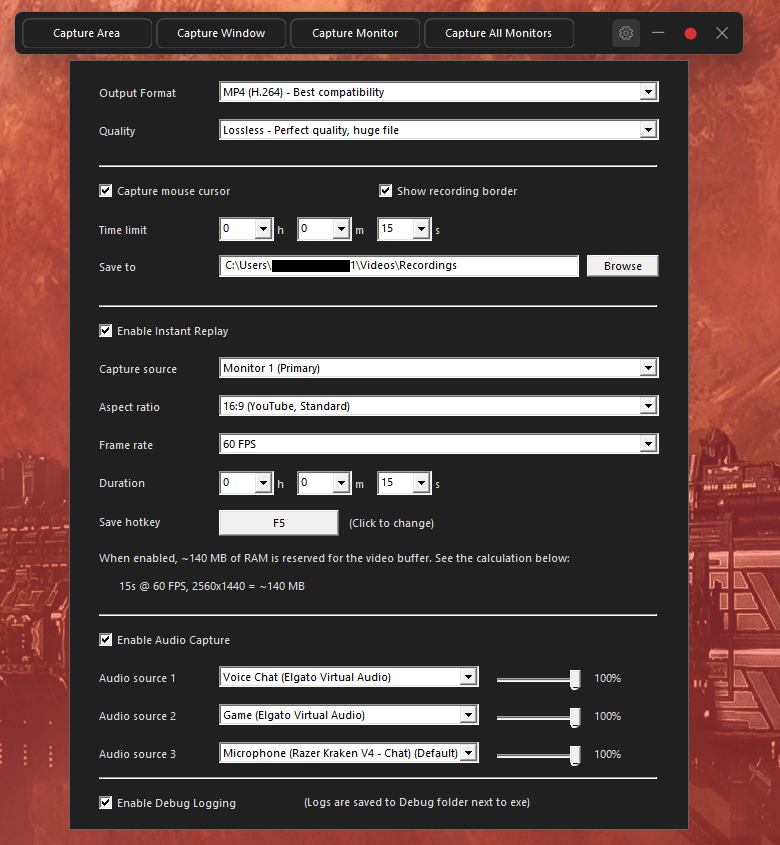

# Light Weight Screen Recorder

Lightweight screen recorder for Windows with instant replay. ~300KB executable, no dependencies. Requires an NVIDIA GPU for hardware encoding.

## What It Does

- Captures screen (area, window, monitor, or all monitors)
- Records to MP4, AVI, or WMV with quality presets
- Buffers the last 1 sec to 20 min in RAM for instant replay
- Saves replays instantly with F4 (<500ms, no re-encoding)
- Mixes up to 3 audio sources with per-source volume control
- Hardware-accelerated via NVENC HEVC + DXGI Desktop Duplication

> [!WARNING]
> The replay buffer stores encoded video in RAM. Higher durations and resolutions use more memory:
>
> | Duration | Resolution | Approx. RAM |
> |----------|------------|-------------|
> | 15 sec   | 1080p 30fps | ~50 MB     |
> | 1 min    | 1080p 30fps | ~200 MB    |
> | 5 min    | 1080p 60fps | ~1.5 GB    |
> | 20 min   | 1440p 60fps | ~8 GB      |
>
> If you're running low on memory, reduce the replay duration or resolution.

## Quick Start

<p align="center">
  
</p>

1. Download the [latest release](https://github.com/coylemichael/light-weight-screen-recorder/releases/latest) and run `lwsr.exe`
2. Click the gear icon to configure replay duration, quality, and audio sources
3. Select a capture mode (Area, Window, Monitor, All Monitors)
4. For Area mode, draw a selection rectangle on screen
5. Click the red record button to start recording
6. Press F4 anytime to save the last N seconds as a replay

## Build

<details>
<summary>Build from source</summary>

Requires Visual Studio Build Tools (MSVC). The build script will prompt to install automatically if not found.

```batch
build.bat
```

Output: `bin\lwsr.exe`

</details>

## Verification

- ✅ **Attestation** - Releases are built on GitHub Actions with [build provenance](https://docs.github.com/en/actions/security-guides/using-artifact-attestations-to-establish-provenance-for-builds)
- ✅ **SHA256 hash** - Each release includes a hash for integrity verification
- ✅ **Open source** - Audit the code or build it yourself
